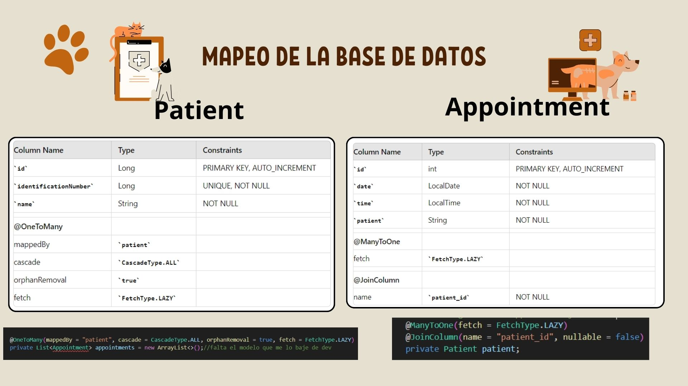
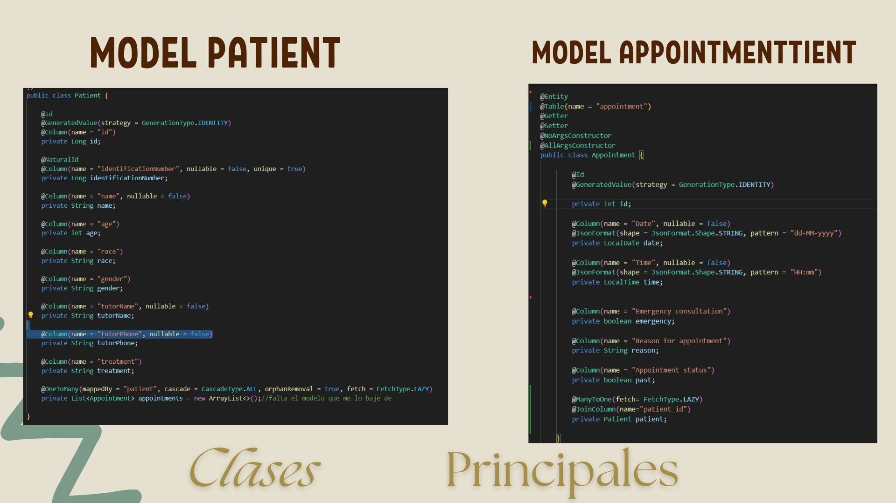
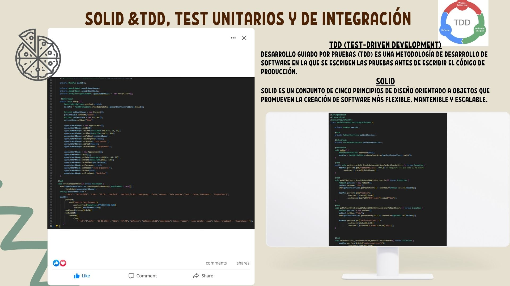

# Veterinary Clinic, Backend.

## Project Context:

Margarita is about to open her veterinary clinic and asks us to create a patient management system. Narciso, the previous developer, has prepared a frontend interface mounted on VUE, but abandoned the work before developing the backend part. Margarita has asked us to finish the project, creating a rest API that stores the data in a MySQL database, and can be consumed from that front.

But it turns out that the Vue file was corrupt and there is no frontend either, so the team had a daily, to resize the project and for me to take care of the Frontend that Narciso left undone. Thanks to the team that was in charge of the client's appointments, and all their Crud and test operations.

Given the rush for delivery dates and this setback, it was decided to implement a simple interface, to be able to deliver an MVP, and base it on the minimum and future functionalities, of which they must have:

1st Login for Clinic staff to log in, and as an extra functionality for Pet Guardians to be able to access their pet's file online, with an appointment history, and in the future to be able to request appointments.

2º Said Login prevents guardians from entering the veterinarians' area and redirects them to the login or to their page if they are already logged in.

3º The veterinarian area has all the CRUD to manage the pet and then the CRUD for the appointments, along with a history of Appointments, since the appointment screen has a filter to only show the current appointments (using the date of the day to act as a filter).

Exit function that leaves the session, so it would be necessary to log in again.

## DB mapping.
## 

## Entitys.
## 

## TDD & Solid.
## 

## The documentation ;) Summary of the work carried out, in the Backend and the frontend.
* [Documentación](https://www.canva.com/design/DAGLY4YNzYk/LFH3L3C8Mhuk6vgx6jrEFg/view?utm_content=DAGLY4YNzYk&utm_campaign=designshare&utm_medium=link&utm_source=editor)

# Versión en Español:

# Clínica Veterinaria, Backend.

## Contexto del Proyecto:

Margarita está a punto de abrir su clínica veterinaria y nos pide la creación de un sistema de gestión de pacientes. Narciso, el anterior desarrollador, ha dejado preparada una interfaz de frontend montada en VUE, pero abandonó el trabajo antes de desarrollar la parte de backend. Margarita nos ha solicitado terminar el proyecto, creando una API rest que almacene los datos en una base de datos MySQL, y pueda ser consumida desde ese front.

Pero resulta que el archivo de Vue estaba corrupto y tampoco hay frontend por lo que el equipo tuvo una daily, para redimensionar el proyecto y que me encargara del Frontend que dejo Narciso sin hacer. Gracias al equipo que se encargo de la parte de las citas del cliente, y toda su operativa del Crud y test.

Ante la premura por las fechas de entrega y ante este contratiempo se decidio implementar una interfaz sencilla, para poder entregar un MVP, y basarnos en las funcionalidades mínimas y las futuras, de las cuales deben tener:

1º Logín para que el personal de la Cñinica se logee, y como funcionalidad extra para los Tutores de las mascotas poder acceder on line a la ficha de su mascota, con un histórico de citas, y en el futuro poder pedir citas.

2º Dicho Login impide a los tutores entrar en la zona de los veterinariosm y lo redirecciona al login o a su pagina si ya estan logeados.

3º La zona de los veterinarios tiene todo el CRUD para gestionar la mascaota y luego el CRUD para las citas, junto a un hitórico de Citas, pues en la pantalla de citas tiene un filtro para solo mostrar las citas actuales(usando la fecha del día para hacer de filtro).

Función de Salir que sales de sesión, por lo que haria falta logarte de nuevo.

## The documentation ;) Resumen del trabajo realizado, en la parte Backend y la frontend.
* [Documentación](https://www.canva.com/design/DAGLY4YNzYk/LFH3L3C8Mhuk6vgx6jrEFg/view?utm_content=DAGLY4YNzYk&utm_campaign=designshare&utm_medium=link&utm_source=editor)

